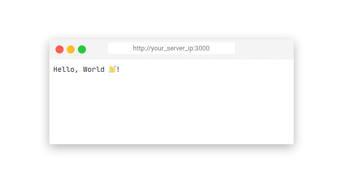

### How to deploy Golang application on any GNU/Linux system, but without Docker

#### Buid main.go
```sh
$ GOOS=linux GOARCH=amd64 go build main.go -o ./hello_world
```

Now, just copy this binary to your remote server inside **/root/go** folder


##### Creating **systemd** service 
```sh
$ nano /etc/systemd/system/hello_world.service
```

- Copy this Code to it:
```sh
[Unit]
Description=Go sample web app
After=multi-user.target

[Service]
User=root
Group=root
ExecStart=/root/go/hello_world

[Install]
WantedBy=multi-user.target

```

- Run & Enable it:
```sh
$ systemctl start hello_world.service
$ systemctl enable hello_world.service
```

#### Setting up a reverse proxy server 
```sh
$ apt install nginx -y
$ systemctl start nginx
```

- Create a config in **/etc/nginx/sites-available/hello_world** file: 
```sh
server {
    listen 80 default_server;
    listen [::]:80 default_server;

    server_name _;

    location /root/go/hello_world {
            proxy_pass http://localhost:3000;
            proxy_http_version 1.1;
            proxy_set_header Upgrade $http_upgrade;
            proxy_set_header Connection 'upgrade';
            proxy_set_header Host $host;
            proxy_cache_bypass $http_upgrade;
    }
}

```

- Create a symbolic link of our config file to the **sites-enabled** folder: 
```sh
$ ln -s /etc/nginx/sites-available/hello_world /etc/nginx/sites-enabled
```

- Finally, reload **nginx** to apply config: 
```sh
$ nginx -t && nginx -s reload
```

####  Final result 
Go to **http://your_server_ip:3000** and see result 🎉


<p float="center">

</p>